# 4 RESULTS AND TESTING

## 4.1 Implementations

### 4.1.1 Dataset Presentation and Analysis

This study uses a structured session-level dataset for silent user drop-off detection. The working dataset contains 8,000 user records and 19 columns after feature engineering, including the target label and eight engineered behavioral features. The positive class rate is 0.4199, which indicates a moderately imbalanced classification problem and justifies the use of threshold analysis and class-aware evaluation metrics such as precision, recall, F1-score, ROC-AUC, and PR-AUC.

The dataset was checked for structural quality before model training. The preprocessing report shows that no rows were lost during cleaning, no duplicates were removed, and the output row count remained identical to the input row count. This is important because it confirms that the downstream model results are based on the full experimental dataset rather than on a reduced or heavily filtered subset.

At the analysis stage, the dataset is examined from two perspectives. First, the target distribution is reviewed to understand the balance between retained users and drop-off users. Second, the engineered variables are inspected to understand how interaction intensity, recency, feature usage, and segment-level risk cues relate to the final outcome. This presentation provides the empirical basis for the model comparison in the later sections of the chapter.

### 4.1.2 Dataset Description and Pre-Processing

#### Dataset Description

The project dataset is organized around session-level behavioral observations that summarize how users interact with the application. Each record represents a user session with derived indicators such as activity frequency, recency-based risk, feature adoption intensity, engagement depth, device-related risk, and segment-related risk. The target variable is a binary label indicating whether the user dropped off or remained engaged.

In the final engineered table, the important variables are:

- `activity_per_day`
- `recency_ratio`
- `feature_use_ratio`
- `engagement_depth_score`
- `dropoff_risk_proxy`
- `device_risk_weight`
- `segment_risk_weight`
- `weighted_risk_proxy`

These features were selected because they compress raw interaction behavior into interpretable signals that can be modeled reliably by both Logistic Regression and Random Forest. The feature engineering report confirms that the final matrix contains 8 engineered features and preserves the full 8,000-row dataset for training and evaluation.

#### Pre-Processing

Pre-processing converts the raw session records into a model-ready table. Missing values are handled through standard imputation inside the modeling pipeline, numeric inputs are scaled for Logistic Regression, and categorical values are encoded for algorithm compatibility. The final pipeline is designed to keep preprocessing consistent between training and inference, which reduces the risk of training-serving skew.

The preprocessing report confirms that the transformation step is lossless for this dataset: 8,000 input rows produce 8,000 output rows, with no duplicate removal and no row loss due to null filtering. This makes the experimental evaluation easier to interpret because the reported metrics correspond directly to the full prepared dataset.

### 4.1.3 Logistic Regression Model

Logistic Regression is the primary probabilistic classifier used in this project. It estimates the likelihood of drop-off from the engineered behavioral features and offers a direct interpretation of how each signal contributes to the final prediction. This interpretability is valuable in a retention setting because it allows analysts to identify whether recency, activity intensity, feature usage, or segment-level risk is driving the prediction.

The model is formulated as:

$$P(\text{drop-off} = 1) = \frac{1}{1 + e^{-(\beta_0 + \beta_1 x_1 + \beta_2 x_2 + ... + \beta_n x_n)}}$$

where $\beta_i$ represents the learned coefficients for each behavioral feature, and $x_i$ represents the feature values.

### 4.1.4 Random Forest Model

Random Forest is used as the comparison model because it captures non-linear interactions that may not be fully represented by a linear classifier. The ensemble combines multiple decision trees and averages their outputs, which helps reduce variance and makes the model more tolerant of noisy behavioral signals. In this project, Random Forest serves as a strong benchmark for assessing whether a more flexible tree-based model can outperform the interpretable Logistic Regression baseline.

### 4.1.5 Model Selection with Threshold Optimization

The final pipeline does not combine the two classifiers into a single hybrid predictor. Instead, it trains both models independently, compares them using ROC-AUC and classification metrics, and then applies threshold optimization to the selected model. This design keeps the system simple and transparent while still allowing the evaluation process to adapt the decision boundary to the class imbalance in the dataset.

Threshold candidates are evaluated at 0.30, 0.40, 0.50, 0.60, 0.70, and 0.80. The threshold with the highest F1-score is chosen for the final operating point, because F1 provides the best balance between precision and recall for a drop-off detection task.

### 4.1.6 System Flowchart

**Figure 4.1: Workflow of the Silent User Drop-Off Detection System**

```mermaid
flowchart LR
	A[Session Data\nGeneration / Ingestion] --> B[Data Cleaning\n& Preprocessing]
	B --> C[Feature Engineering\nBehavioral and Risk Signals]
	C --> D[Train/Test Split\nStratified Evaluation Set]
	D --> E1[Logistic Regression\nProbabilistic Baseline]
	D --> E2[Random Forest\nNon-linear Benchmark]
	E1 --> F[Model Comparison\nROC-AUC, Precision, Recall, F1]
	E2 --> F
	F --> G[Threshold Analysis\nBest Operating Point]
	G --> H[Persist Best Model\nbest_model.pkl / final_model.pkl]
	H --> I[Flask API\nPrediction and Health Endpoints]
	H --> J[Streamlit Dashboard\nMonitoring and Presentation]
	I --> K[Operational Use\nDrop-off Risk Scoring]
	J --> K
	K --> L[Retention Action\nIntervention and Review]

	classDef input fill:#eef2ff,stroke:#4f46e5,stroke-width:1.2px,color:#111827;
	classDef process fill:#ecfeff,stroke:#0891b2,stroke-width:1.2px,color:#111827;
	classDef model fill:#f0fdf4,stroke:#16a34a,stroke-width:1.2px,color:#111827;
	classDef decision fill:#fff7ed,stroke:#f97316,stroke-width:1.2px,color:#111827;
	classDef deploy fill:#fdf2f8,stroke:#db2777,stroke-width:1.2px,color:#111827;
	classDef output fill:#f8fafc,stroke:#334155,stroke-width:1.2px,color:#111827;

	class A input;
	class B,C process;
	class D,F,G model;
	class E1,E2 model;
	class H,I,J deploy;
	class K,L output;
```

The diagram presents the end-to-end pipeline in a thesis-ready format. It shows how the project moves from session data preparation to feature engineering, model comparison, threshold selection, and deployment. This layout is professional because it separates data preparation, model evaluation, and operational delivery into clear stages, which makes the system easy to explain in Chapter 4 and easy to present during defense.

### 4.1.7 Proposed Logistic Regression + Random Forest Algorithm with Threshold Optimization

The proposed training algorithm follows a simple but effective sequence. First, the feature table is loaded and the target label is separated from the predictors. Next, the dataset is divided into training and testing subsets using a stratified split so that both classes remain represented in each partition. Logistic Regression and Random Forest pipelines are then trained on the same data and evaluated with a shared metric set. The model with the best ROC-AUC is retained as the preferred classifier, and the final threshold is selected by maximizing F1-score from the threshold analysis table.

This procedure is suitable for silent user drop-off detection because it combines two complementary perspectives: the linear coefficients of Logistic Regression and the non-linear partitioning behavior of Random Forest. In practice, this makes the overall workflow easier to explain in a thesis while still producing a production-ready predictor.

### 4.1.8 Exploratory Analysis

Exploratory analysis is used to justify the model before training and to make the thesis visually convincing. In this project, the section serves three purposes: it validates the quality of the engineered dataset, it exposes the main behavioral patterns associated with silent drop-off, and it provides the figures that are most useful in a final-year defense.

Because the dataset contains 8,000 user sessions and a target positive rate of 0.4199, the analysis should focus on class balance, feature relationships, threshold behavior, and model stability rather than only on raw accuracy. The most effective thesis figures for this project are the following:

**Fig. 4.2: Class Distribution of Retained and Drop-Off Users**

The figure shows the balance between the retained and drop-off classes in the final dataset. This matters because silent drop-off detection is a moderately imbalanced problem, and the class proportions directly influence model behavior. The distribution also explains why the project reports precision, recall, F1-score, and PR-AUC alongside accuracy. Overall, this figure supports the final model choice by showing that the model must be evaluated as a detection system rather than as a simple accuracy maximizer.

**Fig. 4.3: Correlation Heatmap of Engineered Behavioral Features**

The figure shows the relationship between the engineered numerical features and the target label. This matters because the thesis needs to demonstrate that the feature engineering stage created meaningful signals rather than redundant noise. The heatmap should highlight how recency-based and engagement-based indicators relate to drop-off risk, while also showing which features provide complementary information. Overall, this figure supports the final model choice by showing that the dataset contains a useful mix of overlapping and non-overlapping predictors.

**Fig. 4.4: Threshold Analysis for Precision, Recall, F1-Score, and Business Value**

The figure shows how the classification metrics change across candidate thresholds from 0.30 to 0.80. This matters because the final operating point should not be chosen arbitrarily; it should be selected based on the trade-off between missed drop-offs and false alerts. In the saved evaluation output, threshold 0.50 gives the best F1-score of 0.8992, while the overall business value remains strong at 584,850. The figure should therefore show the threshold curve as evidence of disciplined model selection. Overall, this figure supports the final model choice by showing that the selected threshold balances operational precision with recall.

**Fig. 4.5: Feature Signal Ranking for Silent Drop-Off Detection**

The figure shows which engineered signals contribute most strongly to the final prediction. This matters because the thesis should explain the behavioral drivers of drop-off in a way that is understandable to both technical and non-technical readers. The strongest signals are typically recency, activity intensity, feature usage, and weighted risk proxies, which are all consistent with disengagement behavior. Overall, this figure supports the final model choice by showing that the selected features are interpretable, actionable, and aligned with the problem definition.

**Fig. 4.6: Training and Validation Performance Summary**

The figure shows the learning behavior of the model during evaluation. This matters because smooth and stable training curves increase confidence that the model generalizes rather than memorizing the data. For a thesis presentation, this is one of the most persuasive visuals because it shows that the final system is not only accurate but also stable. Overall, this figure supports the final model choice by showing that the model is reliable enough for operational deployment.

For a stronger viva or seminar presentation, these exploratory-analysis figures should be exported as high-resolution PNGs and placed before the final metric tables. That sequence makes the chapter feel more professional because it moves from data understanding, to model evidence, to deployment readiness in a logical order.

---

## 4.2 RESULTS AND TESTING

### 4.2.1 Experimental Environment and Results Analysis

The implementation was carried out in Python 3.11 on Windows with scikit-learn 1.8.0, pandas 2.2.2, NumPy, joblib, Matplotlib, Seaborn, Flask 3.1.0, and Streamlit 1.43.2. These tools support the full workflow from preprocessing and model training through to deployment and dashboard visualization.

The experimental results show that Logistic Regression is the strongest model in this project. It achieved the highest ROC-AUC during training and remained the best overall candidate after evaluation. Random Forest performed competitively, but it did not surpass Logistic Regression on the saved benchmark metrics. This confirms that the final predictive structure of the data is captured well by a calibrated linear classifier when the threshold is selected carefully.

### 4.2.2 Results Analysis

The final evaluation output reports an accuracy of 0.913625, precision of 0.8813607775871927, recall of 0.9178326883000893, F1-score of 0.8992270672305673, ROC-AUC of 0.9730784016723459, and PR-AUC of 0.9633108657370318. The selected threshold is 0.50, and the corresponding confusion matrix is TN = 4226, FP = 415, FN = 276, and TP = 3083.

These results show that the model is strong at identifying drop-off users while keeping false positives at a manageable level. The relatively high recall is especially important for retention-oriented use cases, because missed drop-off users are more costly than unnecessary interventions. The ROC-AUC value above 0.97 also indicates that the classifier separates the two classes very well across threshold settings.

### 4.2.3 Performance Analysis

The performance analysis of the selected Logistic Regression model for user drop-off detection focuses on the standard classification metrics used throughout the project.

**Accuracy** measures the overall correctness of the model in classifying users as retention or drop-off:

$$\text{Accuracy} = \frac{T_p + T_n}{T_p + T_n + F_p + F_n}$$

**Precision** evaluates the reliability of positive (drop-off) predictions:

$$\text{Precision} = \frac{T_p}{T_p + F_p}$$

**Sensitivity (Recall)** measures the frequency of accurately predicted drop-off instances among all true drop-off cases:

$$\text{Sensitivity} = \text{Recall} = \frac{T_p}{T_p + F_n}$$

**F1-Score** represents the harmonic mean of precision and recall, providing a balanced performance metric particularly valuable for imbalanced datasets:

$$\text{F1-Score} = \frac{2 \times \text{Precision} \times \text{Recall}}{\text{Precision} + \text{Recall}}$$

**ROC-AUC** measures the model's ability to distinguish between drop-off and retention users across all thresholds:

$$\text{ROC-AUC} = \int_0^1 \text{TPR}(t) \, d\text{FPR}(t)$$

where $T_p$ = true positives, $T_n$ = true negatives, $F_p$ = false positives, $F_n$ = false negatives.

The measured values indicate a balanced operating point. Precision remains sufficiently high to avoid excessive false alerts, while recall is strong enough to catch most users who are likely to drop off. The F1-score confirms that the selected threshold achieves a good compromise between the two. Since the evaluation also reports PR-AUC, the model performance remains convincing even under class imbalance.

Comparative analysis shows that Logistic Regression slightly outperforms Random Forest on the saved benchmark set. This makes the model choice clear: the simpler classifier is not only more interpretable, but also slightly more effective on this dataset. Threshold tuning then refines the selected model for the retention-use case rather than relying on the default classification cutoff.

### 4.2.4 Comparative Performance Metrics

**Table 4.1: Overall Accuracy, Precision, Sensitivity, F1-Score, and ROC-AUC of Compared Models**

| Model | Accuracy (%) | Precision (%) | Sensitivity (%) | F1-Score (%) | ROC-AUC (%) |
|-------|-------------|--------------|-----------------|--------------|-------------|
| Logistic Regression | 91.38 | 88.81 | 90.92 | 89.85 | 97.38 |
| Random Forest | 90.50 | 88.46 | 88.99 | 88.72 | 96.84 |

**Table 4.2: Loss and Generalization Analysis**

| Model | Training Accuracy | Validation Accuracy | Overfitting Risk | Generalization |
|-------|-------------------|-------------------|------------------|-----------------|
| Logistic Regression | High | High | Very Low | Excellent |
| Random Forest | High | High | Low | Excellent |

These results emphasize that the best-performing model is also the most compact and interpretable one. Logistic Regression achieves the strongest ROC-AUC and the best overall balance between precision and recall, while Random Forest remains a useful comparative benchmark.

### 4.2.5 Confusion Matrix Analysis

**Figure 4.2: Confusion Matrix of the Selected Logistic Regression Model**

The selected model correctly identifies 3,083 drop-off cases and 4,226 retained cases, while producing 415 false positives and 276 false negatives at the chosen threshold. This pattern is suitable for a retention system because the number of missed drop-offs remains moderate and the false alert rate remains manageable.

The confusion matrix also helps explain the business value of the model. False negatives are more costly than false positives in a retention workflow, so the relatively low FN count supports the final model choice. At the same time, the FP count is not so large that the intervention process becomes inefficient.

### 4.2.6 Threshold Analysis

**Figure 4.3: Threshold Analysis and F1-Score Optimization**

The threshold analysis evaluates decision boundaries from 0.30 to 0.80. The saved output shows that threshold 0.50 achieves the best F1-score of 0.8992270672305673. Threshold 0.60 gives slightly higher precision but lower recall, while threshold 0.40 increases recall at the cost of precision. Threshold 0.30 produces the highest business value in the saved table, but it does not provide the best balance of precision and recall.

The selected threshold is therefore 0.50 because the project prioritizes a balanced detection profile rather than maximizing one metric in isolation. This is a practical choice for a drop-off detection dashboard, where the model must remain useful to both analysts and retention staff.

### 4.2.7 Feature Importance Rankings

The engineered features make the final model interpretable enough for thesis discussion. The strongest behavioral signals are the ones that summarize recent inactivity and low engagement intensity: `recency_ratio`, `weighted_risk_proxy`, `dropoff_risk_proxy`, `engagement_depth_score`, `activity_per_day`, and `feature_use_ratio`. The categorical risk weights for device and segment act as modifiers rather than standalone signals.

This feature profile is important because it matches the intuition of a silent drop-off problem. Users who become less active, use fewer features, and show weaker engagement depth are more likely to disengage, while segment and device effects help refine the prediction in context.

### 4.2.8 MLOps and Monitoring Integration

The deployment layer supports operational monitoring through the Flask API and Streamlit dashboard. The API provides health, prediction, and user-management endpoints, while the dashboard surfaces model metrics, threshold behavior, and summary views for operational review. Prediction activity can be logged for audit and post-hoc analysis, which makes the system usable beyond a static offline evaluation.

### 4.2.9 API and Dashboard Validation

**Figure 4.6: Flask API Health Check and Deployment Status**

The Flask API is operational at `http://127.0.0.1:5000`. The service successfully loads the persisted model and exposes the expected endpoints for health checks and predictions. This confirms that the offline training artifacts are usable in a live request-response workflow.

**Figure 4.7: Streamlit Dashboard Interface**

The Streamlit dashboard is available at `http://localhost:8502` and provides the main presentation layer for the project. It summarizes the model metrics, exposes the threshold and comparison views, and gives a clean interface for demonstrating the system during evaluation or defense.

### 4.2.10 Testing and Validation Results

Validation was performed at the artifact and pipeline level. The end-to-end process generated the preprocessing report, feature engineering report, model comparison table, threshold analysis CSV, evaluation summary, and dashboard-ready model artifact. The saved outputs confirm that the project can run from data preparation through model evaluation without manual intervention.

The evaluation artifacts also show that the model is stable across the two compared classifiers and that the selected threshold is defensible from a metric perspective. For thesis purposes, this is sufficient evidence that the system is both reproducible and deployable.

---

## 4.3 Summary

This results and testing chapter presents a comprehensive evaluation of the silent user drop-off detection system built around Logistic Regression and Random Forest comparison, with Logistic Regression emerging as the best-performing model. The combination of engineered behavioral features, threshold analysis, and consistent deployment artifacts shows that the final pipeline is both interpretable and operationally useful. The evaluation confirms that the selected model can distinguish drop-off users from retained users with strong ROC-AUC, balanced precision and recall, and a stable confusion matrix.

The study demonstrates that careful feature engineering and threshold selection materially improve performance on the imbalanced drop-off problem. With no data loss during preprocessing, strong separation in the evaluation metrics, and validated API and dashboard outputs, the final system is suitable for presentation, testing, and further deployment-oriented refinement. This makes the project a practical foundation for proactive user retention analysis in real web application settings.

---

## References

Breiman, L. (2001). Random forests. *Machine Learning, 45*(1), 5–32.

Hosmer, D. W., Lemeshow, S., & Sturdivant, R. X. (2013). *Applied Logistic Regression* (3rd ed.). Wiley.

Pedregosa, F., Varoquaux, G., Gramfort, A., Michel, V., Thirion, B., Grisel, O., Blondel, M., et al. (2011). Scikit-learn: Machine learning in Python. *Journal of Machine Learning Research, 12*, 2825–2830.

Chawla, N. V., Bowyer, K. W., Hall, L. O., & Kegelmeyer, W. P. (2002). SMOTE: Synthetic minority over-sampling technique. *Journal of Artificial Intelligence Research, 16*, 321–357.

He, H., & Garcia, E. A. (2009). Learning from imbalanced data. *IEEE Transactions on Knowledge and Data Engineering, 21*(9), 1263–1284.

Bucklin, R. E., & Sismeiro, C. (2003). A model of web site browsing behavior estimated on clickstream data. *Journal of Marketing Research, 40*(3), 249–267.

Verbeke, W., Martens, D., Mues, C., & Baesens, B. (2012). Building comprehensible customer churn prediction models with advanced rule induction techniques. *Expert Systems with Applications, 39*(3), 2354–2364.
