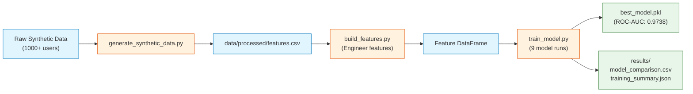
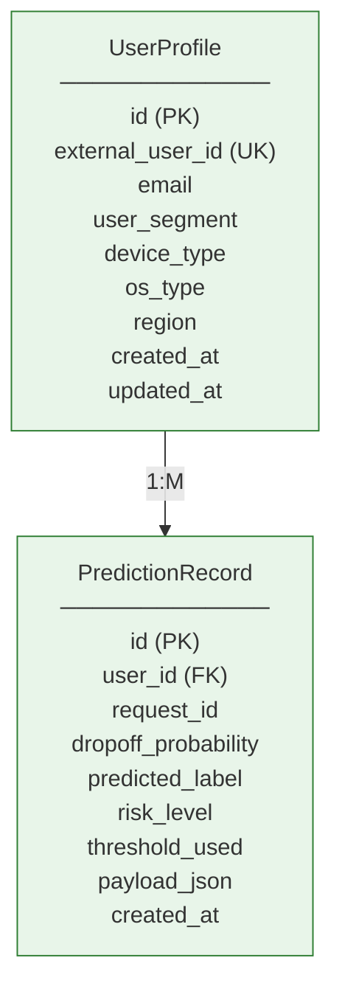
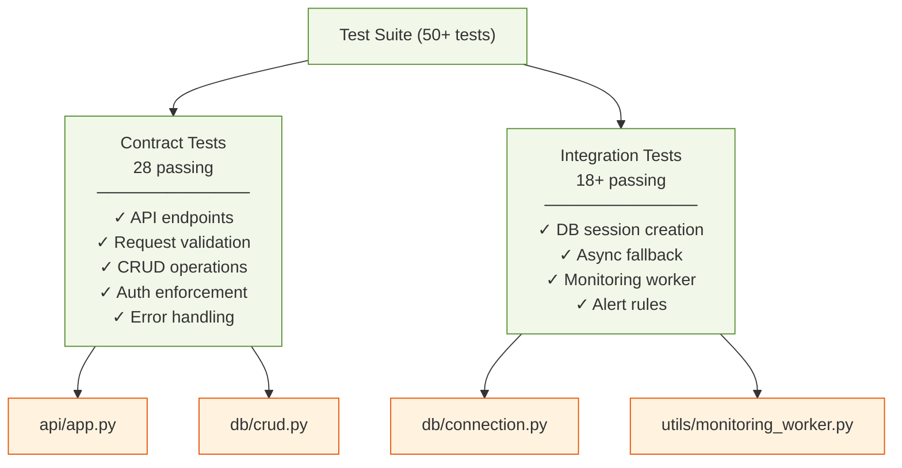
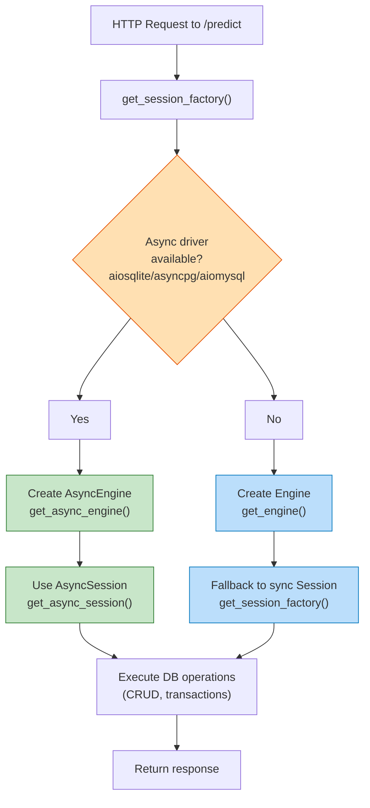

# System Dependency Graph

This document visualizes how the project components depend on each other.

---

## Architecture Overview

```mermaid
graph TB
    subgraph Data["Data Pipeline"]
        GenData["src/data/generate_synthetic_data.py<br/>(Synthetic user behavior data)"]
        RunData["src/data/run_data_step.py"]
        Preprocess["src/data/preprocessing.py<br/>(Clean & normalize)"]
    end
    
    subgraph Features["Feature Engineering"]
        BuildFeatures["src/features/build_features.py<br/>(Feature transformations)"]
    end
    
    subgraph Models["ML Pipeline"]
        TrainModel["src/models/train_model.py<br/>(Training & candidate selection)"]
        EvalModel["src/evaluation/evaluate_model.py<br/>(Metrics & threshold analysis)"]
    end
    
    subgraph Inference["Inference Service"]
        PredictSvc["src/api/prediction_service.py<br/>(Load model, predict, score)"]
        Schemas["src/api/schemas.py<br/>(Request validation)"]
    end
    
    subgraph API["REST API"]
        Flask["src/api/app.py<br/>(Flask server: 11 endpoints)"]
        CRUD["src/db/crud.py<br/>(User/prediction CRUD)"]
    end
    
    subgraph DB["Database Layer"]
        Models_ORM["src/db/models.py<br/>(UserProfile, PredictionRecord)"]
        Connection["src/db/connection.py<br/>(Session factory, async fallback)"]
        Init["src/db/__init__.py<br/>(Public exports)"]
    end
    
    subgraph Utils["Utilities"]
        Auth["src/utils/auth.py<br/>(API key verification)"]
        Config["src/utils/config_loader.py<br/>(Load config.yaml)"]
        Health["src/utils/health.py<br/>(Health checks)"]
        Metrics["src/utils/metrics.py<br/>(Metric collection)"]
        Monitoring["src/utils/monitoring_worker.py<br/>(Background monitor)"]
        Alerts["src/utils/alerts.py<br/>(Alert rules)"]
        Logger["src/utils/logger.py<br/>(Structured logging)"]
        Errors["src/utils/errors.py<br/>(Exception hierarchy)"]
    end
    
    subgraph UI["Dashboard"]
        Dashboard["streamlit_dashboard.py<br/>(7 interactive pages)"]
    end
    
    subgraph Tests["Test Suite"]
        TestContract["tests/contract/test_predict_contract.py<br/>(API guarantees)"]
        TestCRUD["tests/contract/test_crud_operations.py<br/>(DB operations)"]
        TestAsyncFallback["tests/integration/test_connection_async_fallback.py<br/>(Async DB session)"]
    end
    
    subgraph Config["Configuration"]
        ConfigFile["config.yaml<br/>(All settings)"]
        Requirements["requirements-demo.txt<br/>(Dependencies)"]
    end
    
    subgraph Startup["Startup & Orchestration"]
        RunFinal["run_final_process.ps1<br/>(One-click startup)"]
    end
    
    %% Data Pipeline Flow
    GenData --> RunData
    RunData --> Preprocess
    Preprocess --> BuildFeatures
    
    %% Model Training Flow
    BuildFeatures --> TrainModel
    TrainModel --> EvalModel
    EvalModel --> Models_ORM
    
    %% Inference
    TrainModel --> PredictSvc
    EvalModel --> PredictSvc
    PredictSvc --> Schemas
    
    %% API Endpoints
    Schemas --> Flask
    PredictSvc --> Flask
    CRUD --> Flask
    Auth --> Flask
    
    %% Database Layer
    CRUD --> Models_ORM
    Models_ORM --> Connection
    Connection --> Init
    Init --> Flask
    
    %% Utilities
    Config --> TrainModel
    Config --> PredictSvc
    Config --> Flask
    Config --> Connection
    Config --> Dashboard
    
    Auth --> Flask
    Health --> Flask
    Metrics --> Flask
    Monitoring --> Flask
    Alerts --> Flask
    Logger --> Flask
    Logger --> TrainModel
    Logger --> PredictSvc
    Errors --> Flask
    
    %% UI
    Flask --> Dashboard
    CRUD --> Dashboard
    Health --> Dashboard
    Metrics --> Dashboard
    
    %% Tests
    TestContract --> Flask
    TestCRUD --> CRUD
    TestAsyncFallback --> Connection
    
    %% Startup
    ConfigFile --> RunFinal
    Requirements --> RunFinal
    RunFinal --> Flask
    RunFinal --> Dashboard
    
    %% Styling
    classDef dataStyle fill:#e1f5ff,stroke:#0277bd
    classDef modelStyle fill:#f3e5f5,stroke:#7b1fa2
    classDef apiStyle fill:#fff3e0,stroke:#e65100
    classDef dbStyle fill:#e8f5e9,stroke:#2e7d32
    classDef utilStyle fill:#fce4ec,stroke:#c2185b
    classDef testStyle fill:#f1f8e9,stroke:#558b2f
    classDef uiStyle fill:#ede7f6,stroke:#512da8
    
    class GenData,RunData,Preprocess dataStyle
    class TrainModel,EvalModel modelStyle
    class PredictSvc,Schemas,Flask,CRUD apiStyle
    class Models_ORM,Connection,Init dbStyle
    class Auth,Config,Health,Metrics,Monitoring,Alerts,Logger,Errors utilStyle
    class TestContract,TestCRUD,TestAsyncFallback testStyle
    class Dashboard uiStyle
```



---

## Data Flow: Training Pipeline



---

## API Data Flow: Single Prediction

```mermaid
graph LR
    Client["Client (POST /predict)<br/>{user features}"]
    Validate["Schemas.validate_payload()"]
    Infer["Feature Engineering<br/>(engineer_features_for_inference)"]
    Predict["Model.predict_proba()"]
    RiskMap["Map Risk Level<br/>(prob → risk_category)"]
    Record["create_prediction_record()<br/>(Store in DB)"]
    Response["Response<br/>{dropoff_prob, risk_level}"]
    
    Client --> Validate
    Validate --> Infer
    Infer --> Predict
    Predict --> RiskMap
    RiskMap --> Record
    Record --> Response
    
    classDef input fill:#fff3e0,stroke:#e65100
    classDef process fill:#f3e5f5,stroke:#7b1fa2
    classDef db fill:#e8f5e9,stroke:#2e7d32
    classDef output fill:#fce4ec,stroke:#c2185b
    
    class Client input
    class Validate,Infer,Predict,RiskMap process
    class Record db
    class Response output
```



---

## Database Schema & Relationships



---

## Testing & Validation Coverage



---

## Startup Orchestration

```mermaid
graph LR
    Script["run_final_process.ps1"]
    
    Deps["Install<br/>requirements-demo.txt"]
    Migrate["Migrate<br/>DB schema"]
    Tests["Run<br/>contract tests"]
    API["Start<br/>API server<br/>:5000"]
    Dashboard["Start<br/>Dashboard<br/>:8502"]
    Monitor["Monitor<br/>Health endpoints<br/>(polling)"]
    Ready["✓ Ready<br/>API + Dashboard"]
    
    Script --> Deps
    Deps --> Migrate
    Migrate --> Tests
    Tests -->|All pass| API
    API --> Dashboard
    Dashboard --> Monitor
    Monitor -->|Health OK| Ready
    
    classDef step fill:#fff3e0,stroke:#e65100
    classDef success fill:#e8f5e9,stroke:#2e7d32
    
    class Script,Deps,Migrate,Tests,API,Dashboard,Monitor step
    class Ready success
```



---

## Dependency Resolution: Sync vs Async DB



---

## File Tree Summary

```
user-dropoff-detection/
├── src/
│   ├── api/                      # REST API server
│   │   ├── app.py               (Flask app, 11 endpoints)
│   │   ├── prediction_service.py (Inference logic)
│   │   └── schemas.py           (Request validation)
│   ├── db/                       # Database layer
│   │   ├── connection.py        (Pools, async fallback)
│   │   ├── models.py            (ORM models)
│   │   ├── crud.py              (CRUD operations)
│   │   └── __init__.py          (Exports)
│   ├── models/                   # ML pipeline
│   │   └── train_model.py       (Training candidates)
│   ├── evaluation/               # Evaluation
│   │   └── evaluate_model.py    (Metrics & thresholds)
│   ├── data/                     # Data pipeline
│   │   ├── generate_synthetic_data.py
│   │   ├── run_data_step.py
│   │   └── preprocessing.py
│   ├── features/                 # Feature engineering
│   │   └── build_features.py
│   └── utils/                    # Utilities (9 files)
│       ├── auth.py              (API key guard)
│       ├── config_loader.py     (YAML config)
│       ├── health.py            (Health checks)
│       ├── metrics.py           (Metric collection)
│       ├── monitoring_worker.py (Background monitor)
│       ├── alerts.py            (Alert rules)
│       ├── logger.py            (Structured logging)
│       ├── errors.py            (Exception hierarchy)
│       └── ... more utilities
├── tests/
│   ├── contract/                 # Contract tests
│   │   ├── test_predict_contract.py
│   │   ├── test_crud_operations.py (18 tests)
│   │   └── test_alert_rules.py
│   └── integration/              # Integration tests
│       ├── test_connection_async_fallback.py (2 tests)
│       ├── test_monitoring_worker.py
│       └── test_gateway_smoke.py
├── streamlit_dashboard.py         # Web UI (7 pages)
├── run_final_process.ps1          # One-click startup
├── config.yaml                    # Configuration
├── requirements-demo.txt          # Dependencies
├── READY_TO_SUBMIT.md             # Reproduction guide
├── THESIS_CODE_APPENDIX.md        # This document
└── DEPENDENCY_GRAPH.md            # Architecture graph
```

---

## Key Integration Points

| From | To | Via | Purpose |
|------|-----|------|---------|
| API (`app.py`) | Prediction Service | `predict_one()` | Single inference |
| API | DB Layer | CRUD functions | Store/retrieve users & predictions |
| API | Utils | Config, Auth, Logging | Configuration, security, tracing |
| Dashboard | API | HTTP requests | Display user/prediction data |
| Train Pipeline | Models | `joblib.dump()` | Persist trained model |
| Evaluation | Config | YAML | Load thresholds & risk levels |
| Tests | Flask app | test_client | Validate endpoints |
| Tests | DB | Session factory | Test CRUD & async fallback |

---

**Document Version**: May 7, 2026  
**Last Updated**: Async DB integration documented
